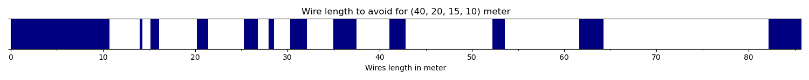

# Random Wire Antenna Calculator

This program helps you to calculate the optimal length of wire for
building a random length antenna.

## Installation

```
$ pip install randwire
```

## Example

```
√ randwire % ./randwire.py
13:45:27 INFO: Bands: 40, 20, 15, 10
13:45:27 INFO: "wire.png" saved
```

This will generate the following image. Where the blue blocks
represent the length of wire to avoid.


